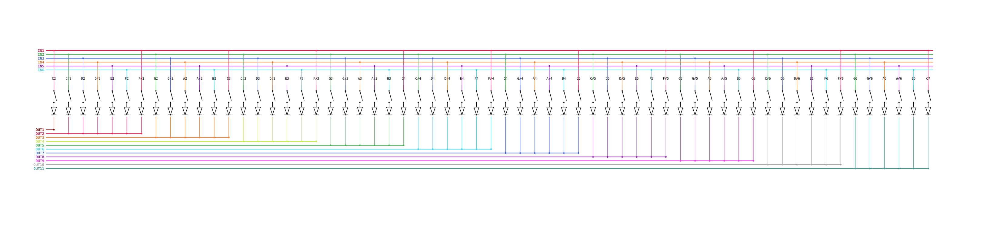

# Allen MOS II Organ Keyboard Matrix to USB MIDI Adapter
This is a Teensy 4.1 sketch for connecting an Allen MOS II Organ's keyboards to a computer over USB MIDI.  It's designed to read the 11x18 combined keyboard matrix, and export them as a MIDI device suitable to connect to any virtual pipe organ.

## Operation
The keyboards all share a common set of read wires.  Each keyboard uses 11 read wires and the pedal board uses 7 of the 11.  Each keyboard has its own set of six signal wires.  To read the keyboards a microcontroller (the organ itself or a Teensy) raises each signal wire in turn to a high state and then reads the key pressed signals from the read wires.  This is done in a sequential cycle, reading many times per second. In this way a relatively few wires can read the entire keyboard quickly, and multiple keys can be pressed at once.

The MOS II Organ, at least our vintage, has its keyboard matrices wired in a peculiar way.  The first key has it's own output wire, and subsequent groups of six keys have their own output wire.  Diodes prevent back feeding. 

The input wires are done differently. There are six input wires per keyboard and each wire feeds the input of every sixth key, with the 61st key having input wire 1 into it.

This asymmetry between the input wires and the output wire groups means the mapping is a little strange.  See the end of this document for a chart.  You can also see the mapping in the ino file.

Here's a diagram of how an individual keyboard is wired.  Both keyboards are wired like this, but each has its own set of six input wires. The pedal board also has six input wires, but only uses seven output wires.

Since the Teensy operates with isolated voltage potential, it's possible for the Teensy and also the built-in Allen organ computer to scan the keyboards at the same time. This should allow a MIDI interface to connect to an unaltered organ.

The sketch turns keyboard presses and releases into MIDI NOTE ON and NOTE OFF events, with a velocity of 127.  The first keyboard events are on channel 1, the second on channel 2, and the pedal board on channel 3.  If you want to change it, you can set it in the sketch.

## Black common wires
The 11 black read wires connect to Teensy pins 20-30.  Looking at the keyboard from the top, the left-most key is connected to its own black wire to pin 20.  Every group of 6 keys after that connects via diodes to a common black wire and those go in order to pins 21 and higher.

Looking at the 44-pin MOS Matrix board connector, the connections are:

| Teensy | MOS Matrix pin |
| ------ | -------------- |
| 20     | 11             |
| 21     | 13             |
| 22     | 9              |
| 23     | 5              |
| 24     | 7              |
| 25     | 3              |
| 26     | 1              |
| 27     | 8              |
| 28     | 10             |
| 29     | 12             |
| 30     | 14             |

## Keyboard 1 Read Wires
The top keyboard matrix is read via six wires, each wire connected to 11 keys.  These are connected left to right to Teensy to pins 2,3,4,5,6,7.  These wires can also be accessed via the 44-pin keyboard matrix edge connector on 22,23,26,25,24, and 21. On our organ these wires are white.

| Teensy | MOS Matrix pin |
| ------ | -------------- |
| 2      | 22             |
| 3      | 23             |
| 4      | 26             |
| 5      | 25             |
| 6      | 24             |
| 7      | 21             |

## Keyboard 2 Read Wires
The second keyboard matrix is also read through six wires that connect to Teensy
's pins 8,9,10,11,12,and 13.  On our organ these are orange wires and are connected to the edge connector to pins 28, 29, 32, 31, 30, and 27.

| Teensy | MOS Matrix pin |
| ------ | -------------- |
| 8      | 28             |
| 9      | 29             |
| 10     | 32             |
| 11     | 31             |
| 12     | 30             |
| 13     | 27             |

## Pedal Board Read Wires
The pedal board is read through six wires that connect to Teensy pins 14, 15, 16, 17, 18, and 19.  These wires are blue on our organ and connect to pins 40, 41, 44, 43, 42, and 39 on the 44 pin matrix edge connector.

| Teensy | MOS Matrix pin |
| ------ | -------------- |
| 14     | 40             |
| 15     | 41             |
| 16     | 44             |
| 17     | 43             |
| 18     | 42             |
| 19     | 39             |

## Mapping of keyboard wires to key/note

| Key | Note | Input | Output | Combination |
|-----|------|-------|--------|-------------|
|  1  | C2   | IN1   | OUT1    | IN1-OUT1 |
|  2  | C#2  | IN2   | OUT2    | IN2-OUT2 |
|  3  | D2   | IN3   | OUT2    | IN3-OUT2 |
|  4  | D#2  | IN4   | OUT2    | IN4-OUT2 |
|  5  | E2   | IN5   | OUT2    | IN5-OUT2 |
|  6  | F2   | IN6   | OUT2    | IN6-OUT2 |
|  7  | F#2  | IN1   | OUT2    | IN1-OUT2 |
|  8  | G2   | IN2   | OUT3    | IN2-OUT3 |
|  9  | G#2  | IN3   | OUT3    | IN3-OUT3 |
| 10  | A2   | IN4   | OUT3    | IN4-OUT3 |
| 11  | A#2  | IN5   | OUT3    | IN5-OUT3 |
| 12  | B2   | IN6   | OUT3    | IN6-OUT3 |
| 13  | C3   | IN1   | OUT3    | IN1-OUT3 |
| 14  | C#3  | IN2   | OUT4    | IN2-OUT4 |
| 15  | D3   | IN3   | OUT4    | IN3-OUT4 |
| 16  | D#3  | IN4   | OUT4    | IN4-OUT4 |
| 17  | E3   | IN5   | OUT4    | IN5-OUT4 |
| 18  | F3   | IN6   | OUT4    | IN6-OUT4 |
| 19  | F#3  | IN1   | OUT4    | IN1-OUT4 |
| 20  | G3   | IN2   | OUT5    | IN2-OUT5 |
| 21  | G#3  | IN3   | OUT5    | IN3-OUT5 |
| 22  | A3   | IN4   | OUT5    | IN4-OUT5 |
| 23  | A#3  | IN5   | OUT5    | IN5-OUT5 |
| 24  | B3   | IN6   | OUT5    | IN6-OUT5 |
| 25  | C4   | IN1   | OUT5    | IN1-OUT5 |
| 26  | C#4  | IN2   | OUT6    | IN2-OUT6 |
| 27  | D4   | IN3   | OUT6    | IN3-OUT6 |
| 28  | D#4  | IN4   | OUT6    | IN4-OUT6 |
| 29  | E4   | IN5   | OUT6    | IN5-OUT6 |
| 30  | F4   | IN6   | OUT6    | IN6-OUT6 |
| 31  | F#4  | IN1   | OUT6    | IN1-OUT6 |
| 32  | G4   | IN2   | OUT7    | IN2-OUT7 |
| 33  | G#4  | IN3   | OUT7    | IN3-OUT7 |
| 34  | A4   | IN4   | OUT7    | IN4-OUT7 |
| 35  | A#4  | IN5   | OUT7    | IN5-OUT7 |
| 36  | B4   | IN6   | OUT7    | IN6-OUT7 |
| 37  | C5   | IN1   | OUT7    | IN1-OUT7 |
| 38  | C#5  | IN2   | OUT8    | IN2-OUT8 |
| 39  | D5   | IN3   | OUT8    | IN3-OUT8 |
| 40  | D#5  | IN4   | OUT8    | IN4-OUT8 |
| 41  | E5   | IN5   | OUT8    | IN5-OUT8 |
| 42  | F5   | IN6   | OUT8    | IN6-OUT8 |
| 43  | F#5  | IN1   | OUT8    | IN1-OUT8 |
| 44  | G5   | IN2   | OUT9    | IN2-OUT9 |
| 45  | G#5  | IN3   | OUT9    | IN3-OUT9 |
| 46  | A5   | IN4   | OUT9    | IN4-OUT9 |
| 47  | A#5  | IN5   | OUT9    | IN5-OUT9 |
| 48  | B5   | IN6   | OUT9    | IN6-OUT9 |
| 49  | C6   | IN1   | OUT9    | IN1-OUT9 |
| 50  | C#6  | IN2   | OUT10   | IN2-OUT10 |
| 51  | D6   | IN3   | OUT10   | IN3-OUT10 |
| 52  | D#6  | IN4   | OUT10   | IN4-OUT10 |
| 53  | E6   | IN5   | OUT10   | IN5-OUT10 |
| 54  | F6   | IN6   | OUT10   | IN6-OUT10 |
| 55  | F#6  | IN1   | OUT10   | IN1-OUT10 |
| 56  | G6   | IN2   | OUT11   | IN2-OUT11 |
| 57  | G#6  | IN3   | OUT11   | IN3-OUT11 |
| 58  | A6   | IN4   | OUT11   | IN4-OUT11 |
| 59  | A#6  | IN5   | OUT11   | IN5-OUT11 |
| 60  | B6   | IN6   | OUT11   | IN6-OUT11 |
| 61  | C7   | IN1   | OUT11   | IN1-OUT11 |

